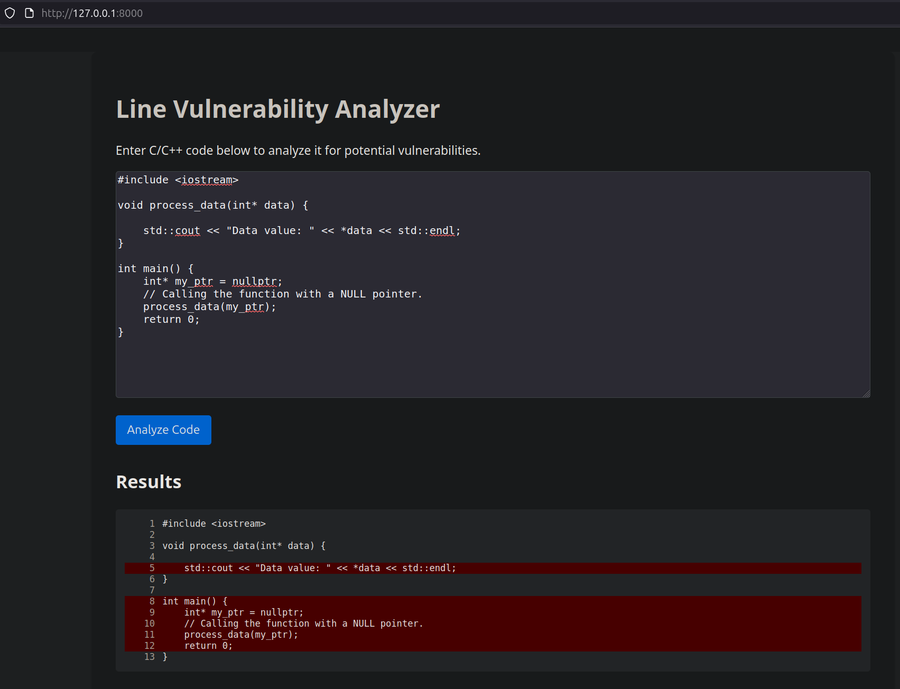

An application built with FastAPI. User can input his cpp code and the web app will highlight the lines predicted as vulnerable.

This project uses a fine-tuned version of CodeBert with additional classification head for vulnerability detection.
The code used for training the LineVul Model can be found in my other [repository](https://github.com/PokjiML/cpp-vulnerability-detection)

